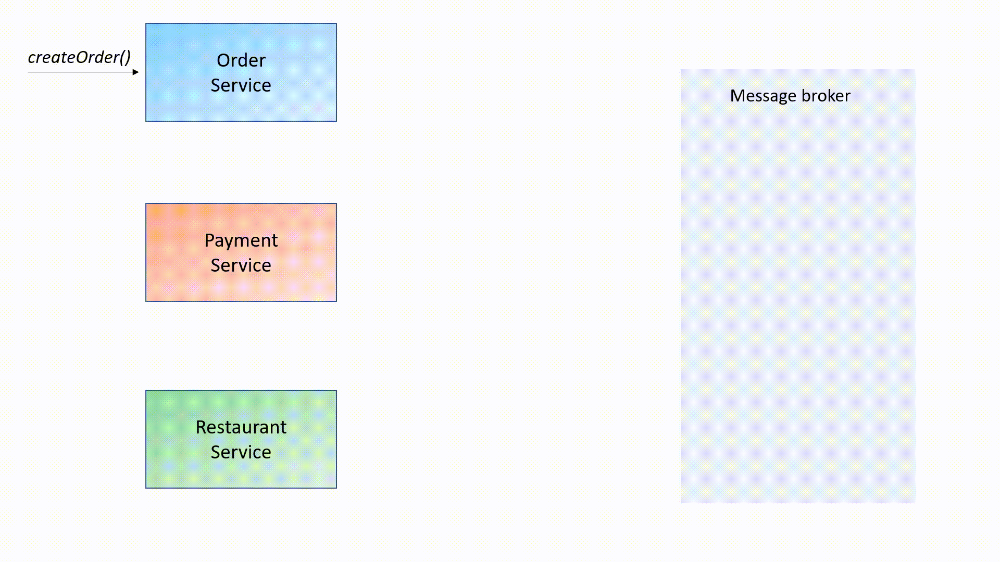
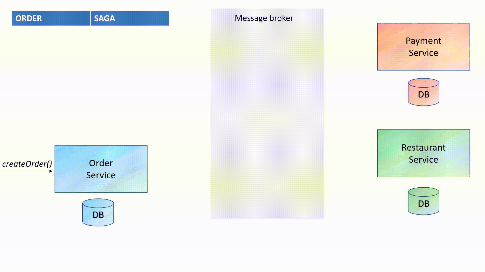
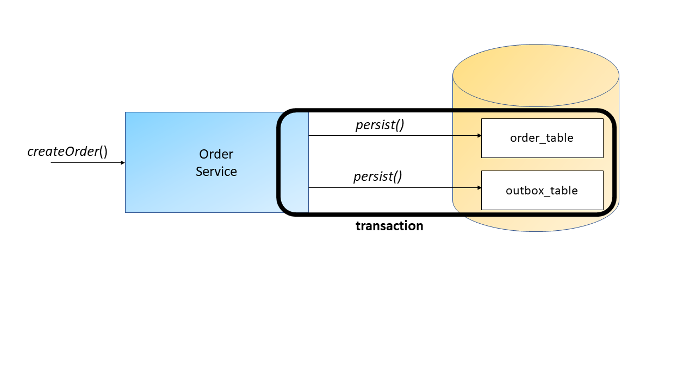

# Bigos App

1. [About](#about)
2. [Application architecture](#application-architecture)
3. [Domain-driven design](#domain-driven-design)
4. [Implemented patterns](#implemented-patterns)  
   4.1 [Hexagonal architecture](#hexagonal-architecture)  
   4.2 [Saga pattern](#saga-pattern)    
   4.3 [Outbox pattern](#outbox-pattern)
5. [How to run](#how-to-run)
6. [App guide](#app-guide)
7. [Contact with me](#contact-with-me)


## About

Bigos app is an example of an application for food ordering. The system
has just a base functionality, i.e. ordering.
The aim of this project is to show a sample implementation of the hexagonal
architecture, saga pattern, and outbox pattern.
For writing this code, I used techniques from the Domain Driven Design.

The application was implemented in `Java 17` using `Spring Boot 2.7.2`.

BDW. Bigos - it is a polish meal :)

## Application architecture

The application consists of 3 microservices that communicate with one another via Apache Kafka.  
Each microservice has its own PostgreSQL database
(for our needs, I used single a database with different schemas).

The whole system can be easily launched using `docker-compose` ([How to run](#how-to-run))


Bigos app consists of a few projects:
* common - the part shared by several projects,
* infrastructure - the module responsible for the infrastructure (kafka configuration, docker, etc.),
* order-service - the microservice allowing creation and viewing of the status of an order,
* payment-service - the microservice responsible for payments management,
* restaurant-service - the microservice responsible for the acceptance of orders by a restaurant.

## Domain-driven design

Domain-driven design, as the name suggests, is an approach to software development that focuses the development on programming a model of a domain.
The topic is too broad to be described in the readMe project :) \
To better understand the subject, I recommend the book **Implementing Domain-Driven Design** by Vaughn, Vernon.

Sample DDD building blocks in BigosApp:
* [Entity](order-service/order-adapters/src/main/java/com/bigos/order/adapters/model/entity/OrderEntity.java)
* [Aggregate](order-service/order-domain/src/main/java/com/bigos/order/domain/model/Order.java)
* [Value Object](common/common-domain/src/main/java/com/bigos/common/domain/vo/Money.java)
* [Domain Service](order-service/order-domain/src/main/java/com/bigos/order/domain/service/OrderDomainServiceImpl.java)
* [Application Service](order-service/order-adapters/src/main/java/com/bigos/order/adapters/OrderApplicationServiceImpl.java)
* [Repository](order-service/order-adapters/src/main/java/com/bigos/order/adapters/out/reposiotry/OrderRepositoryImpl.java)
* [Event](order-service/order-domain/src/main/java/com/bigos/order/domain/event/OrderCreatedEvent.java)
* [Saga](order-service/order-adapters/src/main/java/com/bigos/order/adapters/saga/OrderPaymentSaga.java)

## Implemented patterns

### Hexagonal architecture

The *Hexagonal Architecture* (a.k.a *Ports and Adapters*) is a way of
building the application code.
The main assumption of this pattern is to separate business logic
from external dependencies.
Ports are interfaces that will allow actors to communicate with an application.
Adapters, in turn, implement the interfaces defined by the ports and glue the application with the outside world (for example Rest API).

In the Bigos app, each microservice contains 3 maven modules:

* ##### Domain
It is the core of microservice. This layer does not depend on another layer,
database, Spring framework, etc.
In this layer, ports that describe how the domain can be used are defined.
This layer is the most important, therefore it is covered by unit testing.

* ##### Adapters
It outsources the operation to domain objects and it uses frameworks to ensure data persistence and transactionality.
This layer is also responsible for communication with PostgreSQL and Apache Kafka.

* ##### App
This module holds everything together. It is in charge of microservice launching and parameters configuration.
It contains integration tests.

Using maven modules protects against improper use of the given layers.
In the `pom.xml` file, the dependencies between layers can be defined.
For example, the domain module depends only on the common-domain module [pom.xml from order-domain](order-service/pom.xml)  
The correctness of the proper use of the application's layers is also protected
by architecture tests written using ArchUnit.

Below, you can find tests that prevent the use of other layers in the domain layer:
```java 
    @Test
    void domainShouldNotDependOnAdapters() {
        noClasses()
                .that()
                .resideInAPackage("..domain..")
                .should()
                .dependOnClassesThat()
                .resideInAPackage("..adapters..")
                .check(new ClassFileImporter().importPackages("com.bigos.order"));
    }

    @Test
    void domainShouldNotDependOnApp() {
        noClasses()
                .that()
                .resideInAPackage("..domain..")
                .should()
                .dependOnClassesThat()
                .resideInAPackage("..app..")
                .check(new ClassFileImporter().importPackages("com.bigos.order"));
    }
```  
The test protects against using the Spring framework in the domain layer:

```java 
    @Test
    void domainShouldNotDependOnSpring() {
        noClasses()
                .that()
                .resideInAPackage("..domain..")
                .should()
                .dependOnClassesThat()
                .resideInAPackage("org.springframework..")
                .check(new ClassFileImporter().importPackages("com.bigos.order"));
    }
```  

### Saga pattern
**Saga** is a pattern for maintaining data consistency in distributed architectures where there exist more than one database.
A saga is a sequence of transactions performed in a variety of services to complete one business functionality.
There are two main ways of saga management: *choreography* and *orchestration*:

* Choreography - is a way without a centralized control point, i.e. each service can publish events that will be read by a few services.
* Orchestration - is a way where there exist one central point (the orchestrator) coordinating saga participants. The orchestrator is responsible for managing the overall transaction status.

Of course, as usual in programming, we will adapt the solution to our needs :) \
We can mix these ways of saga coordination and I made it in the Bigos app.
But before I describe why I use a mix of these, let me show you how the choreography or the orchestration could be implemented in Bigos App.
A quick reminder of the difference between an _event_ and a _command_
* command - a message telling consumers what to do. It should have only one consumer.
* event - a message saying what happened. It may have from _0_ to _n_ consumers.

In Bigos app saga choreography happy path can look like this:



1. Order service gets a request to create an order.
2. Order service creates an order and publishes an event called `orderCreated`. This event is read by *Payment* service.
3. Payment service makes a payment and publishes an event `paymentCompleted`. This event is read by *Order* service where order status is changed to PAID. It is also the event read by Restaurant service.
4. Restaurant service accepts an order and publishes an event `orderAccepted`. This event is read by the order service.
5. Order service changes an order status to APPROVED.

In Bigos app saga orchestration happy path can look like below:


1. Order service gets a request to create an order.
2. Order service creates an order and publishes an event `orderCreated`. This event is read by the Orchestrator service.
3. Orchestrator service publishe a command `executePayment`. This command is read by the Payment service.
4. Payment service makes a payment and publishes an event `paymentCompleted`. This event is read by the Orchestrator service.
5. Orchestrator service publishes a command `setOrderStatusToPaid`. This command is read by the Order service.
6. Order service changes an order status to PAID and publishes an event `orderPaid`. This event is read by the Orchestrator service.
7. Orchestrator service publishes a command `acceptOrder`. This command is read by the Restaurant service.
8. Restaurant service accepts an order and publishes an event `orderAccepted`. This event is read by the Orchestrator service.
9. Orchestrator service publishes a command `setOrderStatusToApproved`. This command is read by the Order service.
10. Order service changes an order status to APPROVED and publishe an event `orderApproved`. This event is read by the Orchestrator service.
11. Orchestrator service marks saga as completed.


Choreography has only events, is faster, and needs less code.
In practice, the choreography is hard to maintain. Compensation is difficult to perform and it is not clear what the state of the process it is currently in.

The orchestration has commands and events. It's slower and requires more code --- in this case an additional service.
But thanks to the orchestration, we know where we are in the process at the moment.
If something goes wrong, compensation can be done much easier.

As I wrote before, in the Bigos app I used the mixture of both approaches.
The order service performs the role of an orchestrator. Thanks to this, it is known at what point in the process it is currently. Furthermore, the flow is shorter.
Additionally, I use only events. Hence, if I keep adding more listeners or services, existing code needs no changes.
The happy path implemented flow looks like the below:


1. The Order service gets a request to create an order.
2. The Order service creates an order and publishes an event `orderCreated`. This event is read by the Payment service.
3. The Payment service makes a payment and publishes an event `paymentCompleted`. This event is read by the Order service.
4. The Order service changes an order status to PAID and publishes an event `orderPaid`. This event is read by the Restaurant service.
5. The Restaurant service accepts an order and publishes an event `orderAccepted`. This event is read by the Order service.
6. The Order service changes an order status to APPROVED and finishes the saga.

One of more difficult cases is that the order was rejected even though the payment was correct. The implemented flow looks like the below:



1. The Order service gets a request to create an order.
2. The Order service creates an order and publishes an event `orderCreated`. This event is read by the Payment service.
3. The Payment service makes a payment and publishes an event `paymentCompleted`. This event is read by the Order service.
4. The Order service changes an order status to PAID and publishes an event `orderPaid`. This event is read by the Restaurant service.
5. The Restaurant service rejects an order and publishes an event `orderRejected`. This event is read by the Order service.
6. The Order service changes an order status to CANCELLING and publishes an event `orderCancelling`. This event is read by the Payment service.
7. The Payment service cancels an payment and publishes an event `paymentCancelled`. This event is read by the Order service.
8. The Order service changes an order status to CANCELLED and finishes the saga.

As you can see, the saga can handle business scenarios.
The unavailability of any microservice is also not a problem in the case of asynchronous communication.
The service will come back to life and the saga will continue. But how to deal with unavailability of a message broker?
Is it possible to prevent it?!
Yes! The Outbox pattern can help us with this :)

### Outbox pattern
Often, we have situations when we need to update the database and --- in the same process --- send messages to the message broker.
For example, in Bigos App, when we create an order, the Order service should save an order to the database and emit `orderCreated` event.
These activities must be atomic.
If the Order service saves an order to the database but does not emit `orderCreated` event, the payment service will not handle the payment.
If the Order service emits `orderCreated` event but does not save an order to the database, this order cannot be processed.

Postgres and Apache Kafka are two separate tools.
We do not have guarantee that both tools are available at the same time or that there will be no temporary network problems.
In the Order Service, during creating an order the application saves an order to the database. Next, in the same process it emits an event to Kafka.
If the database is not available, the application throws an exception and an event is not sent.
But when the message broker is not available, application saves an order to the database but does not send an event to Kafka.
In this case, the system stays in the inconsistent status. The reason for that is the fact that even though the process saved data in the database, the event is never sent.


Database transactionality can be used to ensure the consistency of these processes.
Instead of emitting the event immediately to Kafka, we can save information about the order and the `orderCreated` event into two separate tables within one database transaction.



After saving this data to the database, the application tries to emit events to Kafka.
If something goes wrong, the application can try again and again, because it has this event in the database.
When the application successfully emits this event to Kafka, this event can be deleted from the database or its status can be changed.
This pattern solves the previously described problem.
Remember to implement idempotent consumer while using the Outbox Pattern.
Even if you don't use Outbox Pattern but use a message broker that guarantees _at-least-once_ delivery you should implement idempotent consumer. 
## How to run
The Bigos app can be run in an easy way using docker compose. \
When you use commend `docker compose up` in [docker catalog](infrastructure/docker) all infrastructure should start up:
* postgres
* zookeeper
* schema-registry
* kafka-broker1
* kafka-broker2
* kafka-manager
* kafka topics initialization

If you want to save the data created by the docker container, please uncomment the volumes line in [docker compose file](infrastructure/docker/docker-compose.yml)

After that, you can run all microservices. The order doesn't matter:
* order-service
* payment-service
* restaurant-service

## App guide
During the application's start, data should be automatically added to the database. It allows testing the most famous cases.
The requests triggering example cases can be found below.

1. Request to create an order (happy path)
* PATH: **POST** _http://localhost:8001/orders_
* Body:
```json
{
   "customerId": "4ece4645-2658-4c54-a182-b0edcfa46d00",
   "restaurantId": "2888ec2e-6f27-464d-bb68-b7226e2d7d3a",
   "price": 45.50,
   "items": [
      {
         "productId": "1ecf862b-6395-412c-ba56-59d38e2764a3",
         "quantity": 3,
         "price": 10.0,
         "totalPrice": 30.0
      },
      {
         "productId": "1ecf862b-6395-412c-ba56-59d38e2764a5",
         "quantity": 1,
         "price": 15.5,
         "totalPrice": 15.5
      }
   ],
   "address": {
      "street": "Cicha",
      "postalCode": "87-820",
      "city": "Krzewie",
      "houseNo": "1"
   }
}
```

2. Request rejected payment by Payment Service (not enough money)
* PATH: **POST** _http://localhost:8001/orders_
* Body:

```json
{
    "customerId": "4ece4645-2658-4c54-a182-b0edcfa46d00",
    "restaurantId": "2888ec2e-6f27-464d-bb68-b7226e2d7d3a",
    "price": 2031.0,
    "items": [
        {
            "productId": "1ecf862b-6395-412c-ba56-59d38e2764a3",
            "quantity": 200,
            "price": 10.0,
            "totalPrice": 2000.0
        },
        {
            "productId": "1ecf862b-6395-412c-ba56-59d38e2764a5",
            "quantity": 2,
            "price": 15.5,
            "totalPrice": 31.0
        }
    ],
    "address": {
        "street": "Cicha",
        "postalCode": "87-820",
        "city": "Krzewie",
        "houseNo": "1"
    }
}
```

3. Request rejected an order by Restaurant Service (restaurant unavailable)
* PATH: **POST** _http://localhost:8001/orders_
* Body:
```json
{
    "customerId": "4ece4645-2658-4c54-a182-b0edcfa46d00",
    "restaurantId": "4f2f007a-b659-492b-a784-ea7eefd52d8a",
    "price": 45.50,
    "items": [
        {
            "productId": "1ecf862b-6395-412c-ba56-59d38e2764a3",
            "quantity": 3,
            "price": 10.0,
            "totalPrice": 30.0
        },
        {
            "productId": "1ecf862b-6395-412c-ba56-59d38e2764a5",
            "quantity": 1,
            "price": 15.5,
            "totalPrice": 15.5
        }
    ],
    "address": {
        "street": "Cicha",
        "postalCode": "87-820",
        "city": "Krzewie",
        "houseNo": "1"
    }
}
```

Request to get information about the order:
* PATH: **GET** _http://localhost:8001/orders/{orderId}_

## Contact with me
If you have any questions for me, feel free to contact with me:
* [Linkedin](https://www.linkedin.com/in/artur-laskowski94/)
* Email: artur.laskowski94@gmail.com
